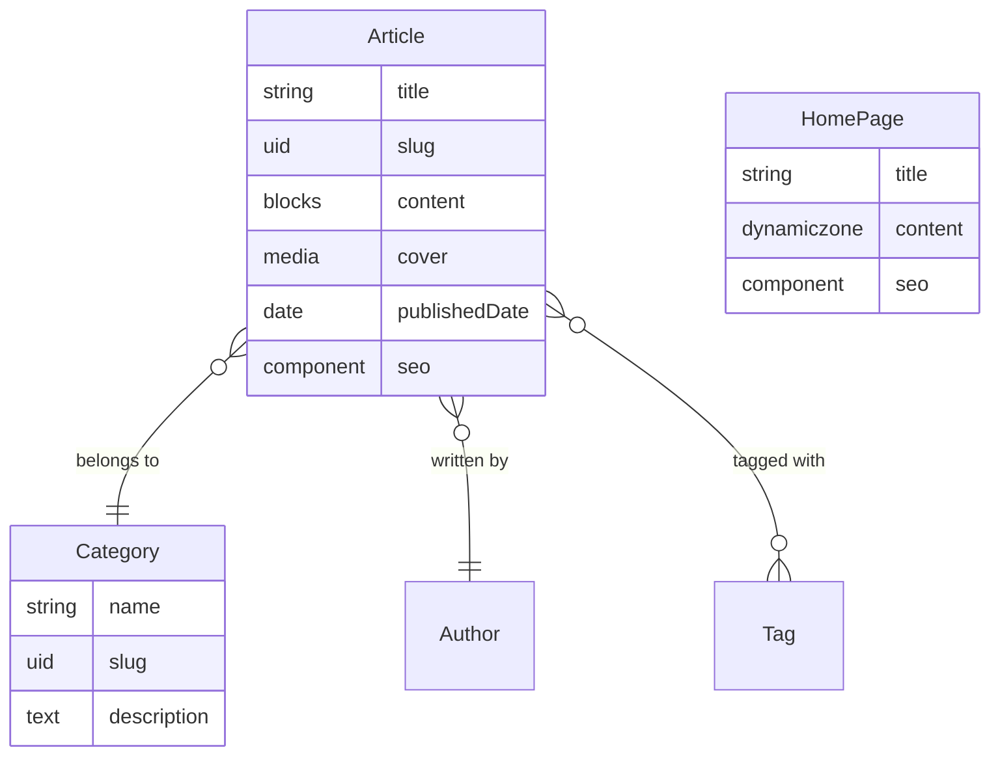

# CMS Data Modeler — Site Analysis to Strapi v5 Schemas

Transform `site-analysis.json` into a complete Strapi v5 data model with content
types, components, relations, and dynamic zones.

## Quick Start

```
User: "Design the data model"
You:
1. Read site-analysis.json
2. Map components/pages to content types
3. Create shared components (seo, link, media)
4. Define relations between types
5. Generate Mermaid diagram
6. Present model for user review
7. Write schema files after confirmation
```

## Inputs

| File | Required | Source |
|------|----------|--------|
| `site-analysis.json` | Yes | design-ingest skill |

**Prerequisite check:** Before starting, verify `site-analysis.json` exists at
the project root. If missing, tell the user to run the design-ingest skill first.

## Outputs

| File/Directory | Purpose | Consumer |
|----------------|---------|----------|
| `content-types/` | Strapi content type schema.json files | strapi-setup |
| `components/` | Strapi component JSON files | strapi-setup |
| `data-model.mermaid` | Visual diagram of all types and relations | User review |

**Output location:** Project root (alongside CLAUDE.md).

## Step-by-Step Process

### Phase 1: Analyze the Site Structure

1. **Read `site-analysis.json`** and extract:
   - All pages (from `pages` array) and their types (unique vs template)
   - All components (from `components` array) with fields and types
   - Navigation structure
   - Global elements (header, footer)
   - Templates and their sections

2. **Classify each page** into a Strapi kind:
   - Pages that are unique (home, about, contact) become **single types**
   - Pages that are template instances (blog posts, services) become **collection types**
   - Pages with varied section layouts become single types **with dynamic zones**

3. **Classify each component** into a Strapi construct:
   - Components that appear as page sections become **dynamic zone blocks** (category: `blocks`)
   - Components that represent collections of items (team members, testimonials, FAQs) become **collection types**
   - Reusable field groups (SEO, links, media) become **shared components** (category: `shared`)
   - Global elements (header, footer) become **single types**

### Phase 2: Design Shared Components

Always create these shared components regardless of site content:

#### `shared.seo` (required on every content type)
Fields: metaTitle (string), metaDescription (text), metaImage (media),
metaRobots (string), canonicalURL (string), structuredData (json)

#### `shared.link` (buttons and CTAs)
Fields: label (string), href (string), isExternal (boolean), variant (enumeration)

#### `shared.media` (images with metadata)
Fields: file (media), alternativeText (string), caption (string)

Create additional shared components based on what `site-analysis.json` reveals:
- `shared.nav-item` / `shared.nav-link` if navigation is present
- `shared.social-link` if social links are detected
- `shared.footer-column` if footer has grouped links

See [references/common-content-types.md](references/common-content-types.md) for
full examples of each shared component.

### Phase 3: Design Content Types

For each page/component identified in Phase 1:

#### Collection Types (repeated content)

For each component with `isCollection: true` or template pages:

1. Create a collection type with:
   - A descriptive `title` or `name` field (string, required)
   - A `slug` field (uid type, targetField pointing to title/name, required)
   - Content fields matching the component's `collectionItemFields`
   - An `seo` component (shared.seo) if the item has its own page
   - An `order` field (integer) if display order matters

2. Map field types from site-analysis to Strapi:

   | Site Analysis Type | Strapi Type |
   |-------------------|-------------|
   | `text` (short) | `string` |
   | `text` (long) | `text` |
   | `richtext` | `blocks` |
   | `image` | `media` (multiple: false, allowedTypes: ["images"]) |
   | `media` | `media` (multiple: false) |
   | `link` | `component` (shared.link) |
   | `date` | `date` or `datetime` |
   | `number` | `integer` or `decimal` |
   | `boolean` | `boolean` |
   | `email` | `email` |
   | `phone` | `string` |

#### Single Types (unique pages)

For each unique page:

1. If the page has a fixed layout (always the same sections in the same order):
   - Create fields directly matching each section's content
   - Use component references for complex sections

2. If the page has flexible layout or many sections:
   - Use a `content` dynamic zone listing all applicable block components
   - Add a `title` field (string)
   - Add an `seo` component (shared.seo)

#### Dynamic Zone Block Components (category: `blocks`)

For each UI component that appears as a page section, create a block component:

- `blocks.hero` — heading, subheading, backgroundImage, cta (shared.link)
- `blocks.text-block` — content (blocks rich text)
- `blocks.card-grid` — heading, cards (repeatable component or relation)
- `blocks.cta-banner` — heading, description, cta (shared.link), variant
- `blocks.image-gallery` — heading, images (media, multiple: true)
- `blocks.faq` — heading, items (repeatable component with question/answer)
- `blocks.testimonial-slider` — heading, testimonials (relation to testimonial collection)
- `blocks.stats-counter` — heading, stats (repeatable: number + label)
- `blocks.feature-grid` — heading, features (repeatable: icon + title + description)
- `blocks.video-embed` — heading, videoUrl (string), caption
- `blocks.logo-cloud` — heading, logos (media, multiple: true)
- `blocks.team-grid` — heading, members (relation to team-member collection)
- `blocks.pricing-table` — heading, plans (repeatable component)

Only create blocks that correspond to components found in site-analysis.json.

### Phase 4: Define Relations

Map relationships between content types:

1. **One-to-Many:** Article -> Category (many articles belong to one category)
2. **Many-to-Many:** Article <-> Tag (articles can have many tags, tags can have many articles)
3. **Many-to-One:** Article -> Author (many articles by one author)

For each relation:
- Set `inversedBy` on the owning side
- Set `mappedBy` on the inverse side
- Use the target format `api::<singularName>.<singularName>`

See [references/strapi-models.md](references/strapi-models.md) for relation syntax.

### Phase 5: Generate Mermaid Diagram

Create `data-model.mermaid` showing all types, fields, and relationships:



Rules for the diagram:
- Show every content type (single and collection)
- List key fields with their Strapi types
- Show all relations with cardinality
- Group block components in a note or separate section
- Use standard Mermaid erDiagram syntax

### Phase 6: User Review

Present the complete model to the user:

1. **Summary table** of all content types:
   | Name | Kind | Key Fields | Relations |
   |------|------|-----------|-----------|

2. **Summary table** of all components:
   | Name | Category | Fields | Used By |
   |------|----------|--------|---------|

3. **The Mermaid diagram** (rendered as code block)

4. **Questions to resolve:**
   - Are there content types that should be merged or split?
   - Should any collection type be a single type instead (or vice versa)?
   - Are there missing relations?
   - Should any fields have different types?

**Wait for user confirmation before writing files.**

### Phase 7: Write Schema Files

After user approval, write all files:

#### Content Type Files

For each content type, write to `content-types/<singularName>/schema.json`:

```
content-types/
├── article/
│   └── schema.json
├── category/
│   └── schema.json
├── home-page/
│   └── schema.json
└── global/
    └── schema.json
```

#### Component Files

For each component, write to `components/<category>/<name>.json`:

```
components/
├── shared/
│   ├── seo.json
│   ├── link.json
│   ├── media.json
│   └── social-link.json
└── blocks/
    ├── hero.json
    ├── text-block.json
    ├── card-grid.json
    └── cta-banner.json
```

#### Mermaid Diagram

Write to `data-model.mermaid` at the project root.

## Key Rules

1. **Every collection type MUST have a `slug` field** — uid type with `targetField`
   pointing to the title/name field.

2. **Every content type MUST have an `seo` component** — `shared.seo`, non-repeatable.
   Exception: utility types like Tag or Category that do not have their own page.

3. **Pages use dynamic zones** — so content editors can reorder sections. The
   dynamic zone field should be named `content` and list all applicable block
   components.

4. **Collection items are separate collection types** — blog posts, team members,
   testimonials, FAQs each get their own collection type. Block components
   reference them via relations, not by embedding all fields.

5. **Single types for unique pages** — home, about, contact each get a single type.
   If a site has only one "services" page with a fixed list, use a single type
   with a repeatable component. If services have individual pages, use a
   collection type.

6. **Shared component category** — reusable pieces (seo, media, cta, link) go in
   the `shared` category. Page section blocks go in the `blocks` category.

7. **Mermaid diagram must be complete** — show all types, their fields, and every
   relationship with cardinality markers.

8. **Use `blocks` for rich text** — prefer the Strapi Blocks editor (`type: "blocks"`)
   over markdown rich text (`type: "richtext"`) for content fields.

9. **Use `draftAndPublish: true`** for content types that editors publish (articles,
   pages). Use `draftAndPublish: false` for structural types (categories, tags,
   settings, navigation).

10. **collectionName convention** — use snake_case plurals: `team_members`,
    `home_pages`. For components: `components_<category>_<name>`.

## Mapping Component Types from Site Analysis

Use this table to decide what Strapi construct to create for each component
type found in `site-analysis.json`:

| Component Type | Strapi Construct |
|---------------|-----------------|
| `hero` | Block component (`blocks.hero`) |
| `navigation` | Single type (`header`) |
| `footer` | Single type (`footer`) |
| `card-grid` | Block component, may reference a collection type |
| `testimonial` | Collection type + block component referencing it |
| `cta-banner` | Block component (`blocks.cta-banner`) |
| `text-block` | Block component (`blocks.text-block`) |
| `image-gallery` | Block component (`blocks.image-gallery`) |
| `contact-form` | Block component (`blocks.contact-form`) |
| `faq` | Collection type + block component referencing it |
| `pricing-table` | Block component with repeatable plan component |
| `team-grid` | Collection type + block component referencing it |
| `stats-counter` | Block component with repeatable stat items |
| `logo-cloud` | Block component (`blocks.logo-cloud`) |
| `video-embed` | Block component (`blocks.video-embed`) |
| `blog-listing` | Block component referencing article collection type |
| `feature-grid` | Block component with repeatable feature items |
| `accordion` | Block component with repeatable items |
| `tabs` | Block component with repeatable tab items |
| `timeline` | Block component with repeatable timeline items |
| `map` | Block component (`blocks.map`) |
| `custom` | Analyze fields and create appropriate construct |

## Composing With Other Skills

This skill consumes output from design-ingest and produces input for strapi-setup:

- **design-ingest** (upstream) produces `site-analysis.json`
- **strapi-setup** (downstream) reads `content-types/` and `components/`
- **frontend-builder** (downstream) reads `content-types/` for API shape
- **content-migration** (downstream) reads `content-types/` to know field mappings

## References

| Reference | Purpose |
|-----------|---------|
| [references/strapi-models.md](references/strapi-models.md) | Strapi v5 model format, attribute types, relations |
| [references/seo-patterns.md](references/seo-patterns.md) | SEO component patterns, JSON-LD schemas |
| [references/common-content-types.md](references/common-content-types.md) | Example schemas for blog, landing page, team, FAQ, etc. |

## Checklist Before Completing

- [ ] `site-analysis.json` was read and all components/pages are accounted for
- [ ] Every collection type has a `slug` field (uid)
- [ ] Every content type has an `seo` component (shared.seo)
- [ ] All shared components created (seo, link, media at minimum)
- [ ] Dynamic zones list only components that exist in `components/blocks/`
- [ ] All relations have both sides defined (inversedBy/mappedBy)
- [ ] `collectionName` values are unique across all schemas
- [ ] Mermaid diagram shows all types, fields, and relations
- [ ] User reviewed and approved the model before files were written
- [ ] All schema files are valid JSON
